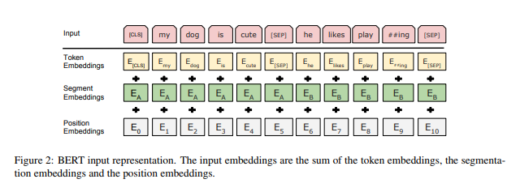

@def title = "Using BERT for Sentiment Analysis"
@def published = "10 December 2019"
@def tags = ["julia", "code-in"]

# Using BERT for Sentiment Analysis

This post is going to be a bit longer, so bear with me. I've tried to explain
everything a beginner (like me) can understand about the BERT model. This is
also a part of submission for one of my GCI task where I was expected to train
and test a dataset with BERT and use it as a classifier. There are more details
in the following text.

So, first lets get the basics out of the way:

## Basics

Bidirectional Encoder Representations from Transformers (BERT) is one of the
most powerful language models right now. It was first published by Google AI in
2018 in a [paper](https://arxiv.org/pdf/1810.04805.pdf). The key point of BERT
is to apply the bidirectional training of Transformer. At this point, you might
be wondering what Transformers are, right? Well, I won't be getting deep into it
so I want to recommend an
[excellent post by Peter Cheng](https://nextjournal.com/chengchingwen/jsoc-2019-practical-implementation-of-bert-models-for-julia)
who has explained it in a very simple yet meaningful way. Do check it out, if
you really want to know the basis of the BERT model.

We'll now see how BERT works since this is quite important. I'll try to make it
short to make it more understandable.

### How BERT works?

BERT makes use of Transformer, an attention mechanism that learns contextual
relations between words (or sub-words) in a text. In its vanilla form,
Transformer includes two separate mechanisms, an encoder that reads the text
input and a decoder that produces a prediction for the task. Since BERT’s goal
is to generate a language model, only the encoder mechanism is necessary. The
detailed workings of Transformer are described in a paper by Google.

As opposed to directional models, which read the text input sequentially
(left-to-right or right-to-left), the Transformer encoder reads the entire
sequence of words at once. Therefore it is considered bidirectional, though
it would be more accurate to say that it’s non-directional. This characteristic
allows the model to learn the context of a word based on all of its surroundings
(left and right of the word).

In BERT, we don't represent each word as a vector (as we've been doing since
years in NLP) instead we represent each 'subword token' as a vector. That is,
whenever the model finds an unknown word it tries to split the word into
sub-pieces like the word root, prefixes, etc  and use all the representational
vectors of each sub-pieces together to represent the unfamiliar word.



Finally, we take the output of the last encder block as our final representation.
We can just feed the representation of our old NLP model to BERT and get a much
better performance. This means that the BERT isn't as complicated as some of the
other NLP models. However, the BERT model is VERY large. As an instance,
for the Aamzon Review dataset I wasn't able to train 10 reviews on my 6 GB GPU.
Which I think is insane! I'll get into more details in the upcoming sections.

Well, that's for the general introduction to the BERT model. Its actually not
complete, but I will mention those things over my own task to avoid redundancy
in information.

## What was my task and how I did it?

My task was to train and test
[Amazon Review dataset](https://www.kaggle.com/bittlingmayer/amazonreviews)
using BERT model present in
[Transformers.jl](https://github.com/chengchingwen/Transformers.jl) package.

One of the nicest things of this task was that I was not aware of any such
model. One of the key reasons of me participating and contributing to Julia
was I wanted to get into Machine Learning and I wanted to learn a new language.
Being introduced to such algorithms is I think one of the best things I could
ever get. This task was also tagged as 'Advanced' and while I've completed it,
I clearly understand why.

In order to complete the task, I need to have a complete basic understanding of
the model. It was a tough job, and while reading various blogs, papers, articles
it was hard to process all that information. There are I think a lot of factors
which I think only experienced ML people would get at first instance. I had to
Google almost every new term I had discovered while reading. So, I spent time
reading and understanding and after I had a basic idea, I was ready to look at
the example code.

The Transformers.jl repository already has few examples on BERT. Here we are
working on Sentiment Analysis and hence we need to construct a classifier. We
will now see the code and the output for the model I constructed. Its a bit
long, and I won't be able to explain each and every section of the code. But,
I'll cover up the important ones.

### Step 1: Prepare everything

First thing I believe is to prepare the data. You should download all the
data files and keep them inside a folder. You'd need some more files but, that
would be a part of the code itself. Also, I'm using IJulia to code everything
out, and I would highly recommend it since it can save you a lot of time,
especially if you are new to Julia.

Also, we need to have all the dependencies installed before we move towards
coding.

>Note: You'll need to have Julia 1.1 installed to manage the dependencies.
This might change later on, but for now Transformers and its dependencies
might not work on other versions.

```
julia> ]

(v1.1) pkg> add Transformers
```

Specific version of Flux is required here.
```
(v1.1) pkg> add Flux@0.9.0
```

We need CuArrays at version 1.3.0.
```
(v1.1) pkg> add CuArrays@1.3.0
```

Currently, TextAnalysis works with Flux 0.9.
```
(v1.1) pkg> add TextAnalysis
```

Mange the versions as you'd want them. These versions *can* change in the future
and you'll need to find one combination that works with all. Once, you've done
that we can move towards coding part.

You can find entire notebook here. (No link, will publish it after GCI).

First, lets get all of the packages imported

```julia
using CuArrays

using Transformers
using Transformers.Basic
using Transformers.Pretrain
using Transformers.Datasets
using Transformers.BidirectionalEncoder

using Flux
using Flux: onehotbatch, gradient
import Flux.Optimise: update!
using WordTokenizers
```

Also, some constants we'll be using:

```julia
const labels = ("0", "1")
const opt = ADAM(1e-6)
const Batch = 2
const Epoch = 1
```
Of course, you can change these as per your requirement. I've set Batch to 2
to save some memory and Epoch to 1 to save some time. Epoch being one just
would mean that there will be a single iteration of weights update.

Now, lets get the pretrained model. Here the downloading extracting the model
will be taken care of by Transformers. All you need to do is following.

```julia
const _bert_model, wordpiece, tokenizer = pretrain"Bert-uncased_L-12_H-768_A-12"
```

There are many variants released for the pre-trained model which you can find
on Transformers docs or online or just run `pretrains()` to find available ones.
I'm going to go with the above one.

You might need to type `Y` as stdin. Alternatively, you can set
`DATADEPS_ALWAYS_ACCEPT=true` to avoid that.

### Step 2: Preprocess data

We need to first clean the data before we could use it. We can do this by using
TextAnalysis.jl package.

```julia
using TextAnalysis

function preprocess_data()
    open("pre_train.txt") do file
        lines = readlines(file)
        for line in lines
#             tag = line[1:10]
            tag = line[1]
            str_rev = line[3:end]
            str_doc = StringDocument(str_rev)
            prepare!(str_doc, strip_punctuation | strip_non_letters | strip_numbers)
            remove_case!(str_doc)
            stem!(str_doc)
            text(str_doc)
            open("new_pre_train.tsv", "a") do nfile
                newtext = text(str_doc)
                write(nfile, "$newtext\t$tag\n")
            end
        end
    end
end

preprocess_data()
```

This above code might look a little ugly (I might need to learn few more
functions but let's keep it as future work), but it gets the job done.
You should be doing this for training data, since this will clean up most of it
that we don't require.

To prepare it the way we require, we would need to add few more functions. This
will create an iterator like object for our data.

```julia
using DelimitedFiles

function gen_train()
    sets = readdlm("new_pre_train.tsv", '\t', String, quotes = false)
    return [selectdim(sets, 2, i) for i = (1,2)]
end

datas = gen_train() # This will be used in the `train!()` function
```

```julia
const vocab = Vocabulary(wordpiece)

markline(sent) = ["[CLS]"; sent; "[SEP]"]

function preprocess(batch)
    sentence = markline.(wordpiece.(tokenizer.(batch[1])))
    mask = getmask(sentence)
    tok = vocab(sentence)
    segment = fill!(similar(tok), 1)
    
    label = onehotbatch(batch[2], labels)
    return (tok = tok, segment = segment), label, mask
end

preprocess(get_batch(datas, 4))
```

Here basically what we do it get mask for a sentence, on a way that we don't
want the model to return the same output. Masks lets us hide it to get a
different output. We'd be defining the `get_batch` function as well as the
datas. Here, datas represent the training or testing data we will be using
in this model.

```julia
function get_batch(c::Channel, n=1)
    res = Vector(undef, n)
    for (i, x) ∈ enumerate(c)
        res[i] = x
        i >= n && break
    end
    isassigned(res, n) ? batched(res) : nothing
end
```

### Step 3: Training and testing the model

First, lets define the `bert_model` and the `clf`.

```julia
const clf = gpu(Chain(
        Dropout(0.1),
        Dense(size(_bert_model.classifier.pooler.W, 1), length(labels)),
        logsoftmax
))

const bert_model = gpu(
    set_classifier(_bert_model,
                    (
                        pooler = _bert_model.classifier.pooler,
                        clf = clf
                    )
                  )
)
```

We'd be calculating the log cross entropy loss through the loss function:

```julia
function loss(data, label, mask=nothing)
    e = bert_model.embed(data)
    t = bert_model.transformers(e, mask)

    p = bert_model.classifier.clf(
        bert_model.classifier.pooler(
            t[:,1,:]
        )
    )

    l = Basic.logcrossentropy(label, p)
    return l, p
end
```

Finally, lets define the `train!()` fucntion

```julia
function train!()
    global Batch
    global Epoch
    @info "start training:"
    for e = 1:Epoch
        @info "epoch: $e"
        datas = datas_tr # Training data generated

        i = 1
        al::Float64 = 0.
        while (batch = get_batch(datas, Batch)) !== nothing
            data, label, mask = todevice(preprocess(batch))
            l, p = loss(data, label, mask)
            # @show l
            a = acc(p, label)
            al += a
            grad = gradient(()->l, ps)
            i+=1
            update!(opt, ps, grad)
            i%16==0 && @show al/i
        end

        test()
    end
end
```

After looping through all of the data, we will move towards testing it:

```julia
function test()
    Flux.testmode!(bert_model)
    i = 1
    al::Float64 = 0.
    datas = datas_te # Testing data generated
    while (batch = get_batch(datas, Batch)) !== nothing
      data, label, mask = todevice(preprocess(batch))
      _, p = loss(data, label, mask)
      # @show l
      a = acc(p, label)
      al += a
      i+=1
    end
    al /= i
    Flux.testmode!(bert_model, false)
    @show al
end

!train()
```

Finally, the `al` will represent the overall accuracy in the output. Here, there
are just a lot of things to explain if you go code by code. But, there are lot
of simple things as well which don't need explaining.

If anyone who is very new to all this should read or learn a bit more about the
functions and what they represent and try to understand how the code is written
and what task it does.

>I would like to give you one pro tip: Just create another notebook and run each
function to see that does it output. See if you can relate the output to the
task it is performing. It is very helpful when the names of the functions are
confusing.

Finally, I would like to conclude this post. I would like to mention few things
I learned while doing this task:

1. The BERT Model: Maybe not everything there is about it but a lot in this
small time span.

2. Transformers: I only knew Transformers from the movie :P. Now I know the real
ones!

3. Few technical terms about Machine Learning and NLP.

4. A lot about writing Julia code: I'm still getting there where you could just write
clean, error-free code. But, I certainly took a major step in that direction.

5. Using TextAnalysis for processing data: I had missed using these functions
in the previous models, now I've used them here and they're quite useful.

## Thank you!

The task doesn't complete without the help of mentors. I'm very happy to get
some awesome mentors for this task. A HUGE thanks to
[Peter Cheng](https://github.com/chengchingwen) for helping me out in all of
my silly doubts. I couldn't have completed this task without him.

Also, thanks to my mentor [Avik Sengupta](https://github.com/aviks) who took
time and helped me out wherever required.

Also thanks to the awesome Julia community!

## References

1. https://arxiv.org/pdf/1810.04805.pdf

2. https://nextjournal.com/chengchingwen/jsoc-2019-practical-implementation-of-bert-models-for-julia

3. https://nextjournal.com/chengchingwen/jsoc-2019-blog3end-of-phase-two-bert-model-in-julia

4. https://chengchingwen.github.io/Transformers.jl/dev/

5. https://towardsdatascience.com/bert-explained-state-of-the-art-language-model-for-nlp-f8b21a9b6270

